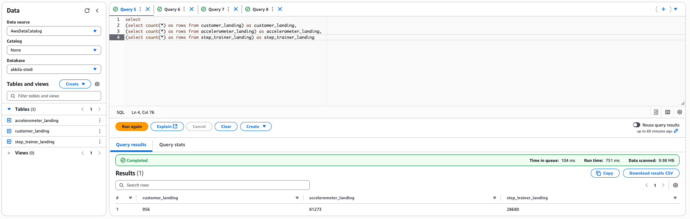
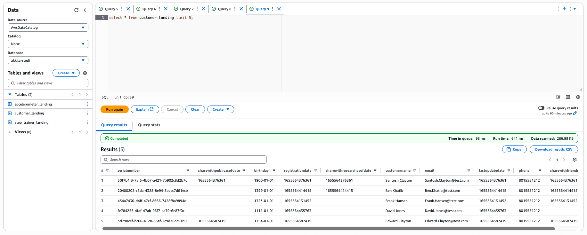

# Udacity STEDI Project

## Contents

+ [Implementation/Evidences](#Implementation/Evidences)

## Implementation/Evidences

Landing Zone

 The raw data is stored in the landing tables. These tables got create with SQL DDL transactions.
 
 [accelerometer_landing.sql](SQL_Tables/accelerometer_landing.sql)
 
 [customer_landing.sql](SQL_Tables/customer_landing.sql)
 
 [step_trainer_landing.sql](SQL_Tables/step_trainer_landing.sql)

These are AWS Glue Tables and can get queried by AWS Athena

Row Count:
 

All Customers are currently included even they not agreed to share their data for research purposes 

Trusted Zone

