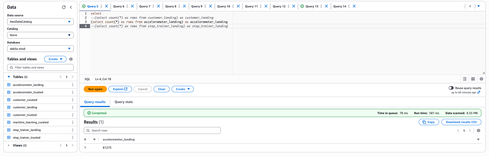
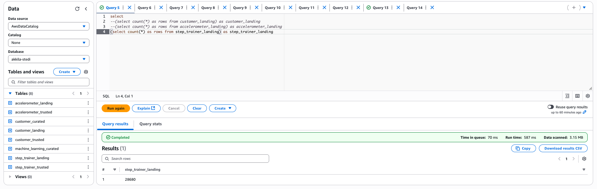
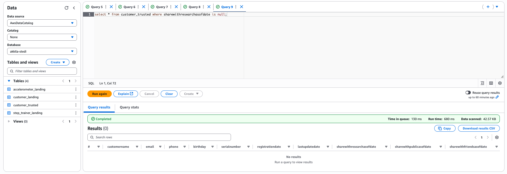
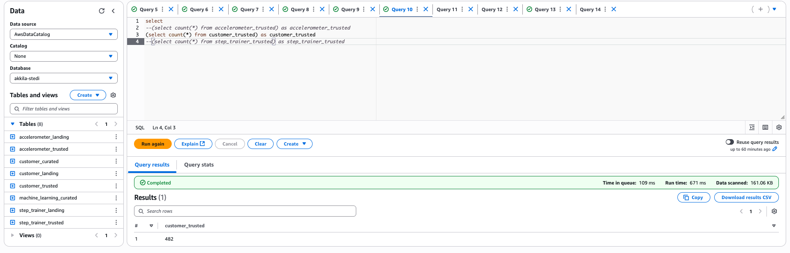
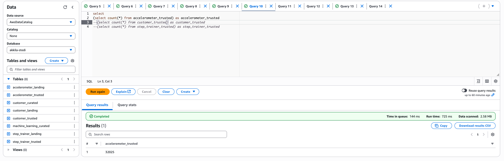
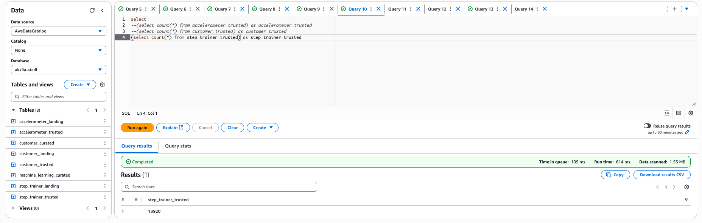
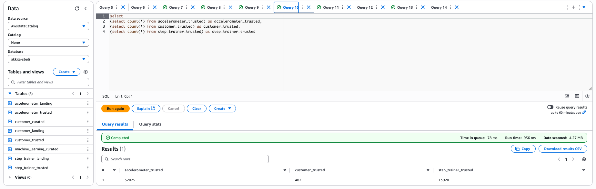
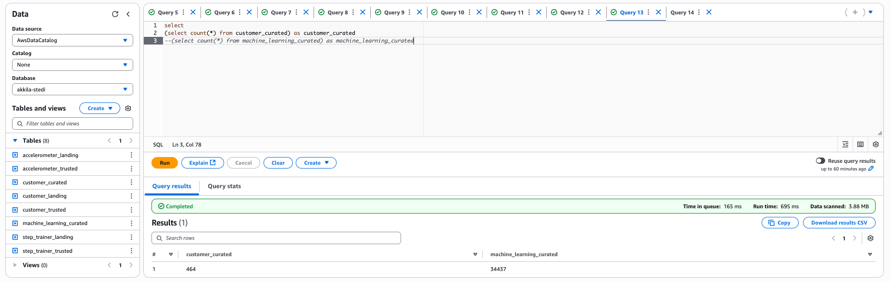
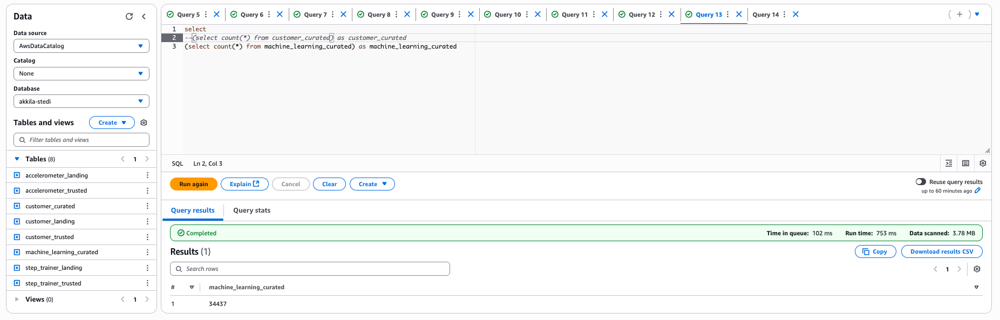
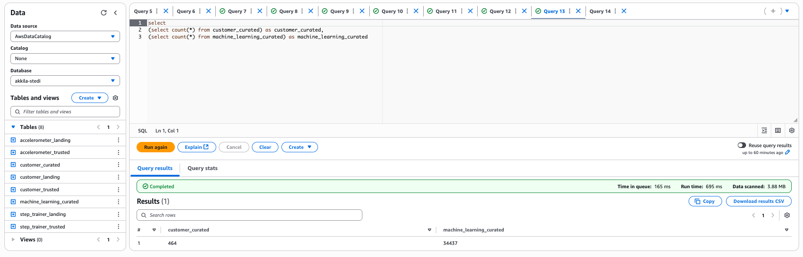

### Udacity STEDI Project

## Contents

+ [Implementation/Evidences](#Implementation/Evidences)

### Implementation/Evidences

Landing Zone

 The raw data is stored in the landing tables. These tables got create with SQL DDL transactions.
 
 [accelerometer_landing.sql](SQL_Tables/accelerometer_landing.sql)
 
 
 
 [customer_landing.sql](SQL_Tables/customer_landing.sql)
 
 
 
 [step_trainer_landing.sql](SQL_Tables/step_trainer_landing.sql)
 

These are AWS Glue Tables and can get queried by AWS Athena

Row Count:
 

All Customers are currently included even they not agreed to share their data for research purposes:

Trusted Zone

# Customer

The Customer trusted table is created via an AWS Glue script [customer_landing_to_trusted.py](customer/trusted/customer_landing_to_trusted.py). Only Customers who agreed to share their data for research purposes are included. 
 

# Accelerometer

The Accelerometer trusted table is created via the following AWS Glue script [accelerometer_landing_to_trusted.py](accelerometer/trusted/accelerometer_landing_to_trusted.py).
Its only the data included after they agreed to share their data. 

# Step Trainer

The Step Trainer trusted table is created via the following AWS Glue script [step_trainer_landing_to_trusted.py](step_trainer/trusted/step_trainer_landing_to_trusted.py). 
There is only the data keept that has accelerometer data and the customer agreed to share it. 

Note: The step trainer trusted table has the row count because I used the customer curated table. If I would use the customer trusted table the row count would be 14460.

## Row Count Evidence

Note: The step trainer trusted table has the row count because I used the customer curated table. If I would use the customer trusted table the row count would be 14460. 

Curated Zone

# Customer

The Customer curated table has only the customer included that have accelerometer data and the customer agreed to share the data.
Its also GDPR complaint because personal data is removed. Its created via the following script
[customer_trusted_to_curated.py](customer/curated/customer_trusted_to_curated.py).

# Maschine Learning

This table has the step trainer and the accelerometer data from customer who agreed to share their data. 
Personal informations are removed. Its created via the following script
[Machine_learning_curated.py](step_trainer/curated/Machine_learning_curated.py).
The glue table is called machine_learning_curated.

## Row Count Evidence

 

